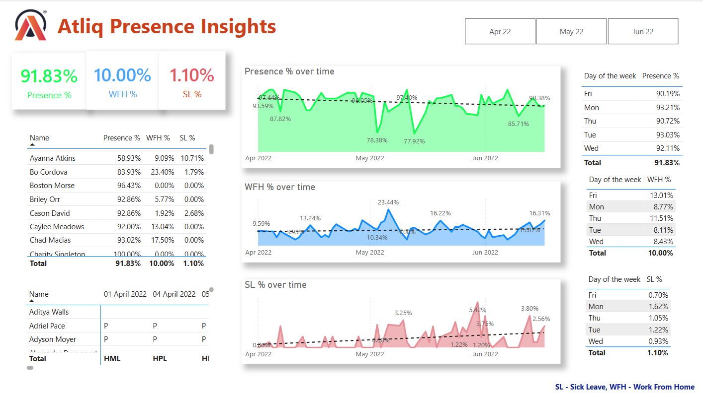

# 📊 Atliq Presence Insights – HR Analytics Dashboard (Power BI)

An interactive dashboard built using **real employee attendance data from Atliq** to analyze workforce presence, work-from-home (WFH), and sick leave (SL) trends. This project provides HR teams with actionable insights into employee behavior and attendance across weekdays and months.

---

## 🎯 Project Objective

To design a visual analytics dashboard that:
- Tracks employee attendance through **Presence %, WFH %, and Sick Leave %**
- Identifies behavioral trends across **days of the week** and **monthly timeframes**
- Enables data-driven decisions for **HR strategy and workforce management**

---

## 📁 Dataset Used

- **Source**: Real, anonymized HR attendance data from Atliq  
- **Format**: Excel (.xlsx)  
- **Download Link**: [Click here to view/download the dataset](https://github.com/H-4-R-S-H/Atliq-HR-Analytics/blob/main/Attendance%20Sheet%202022-2023_Masked.xlsx)  
- **Period Covered**: April 2022 to June 2022  
- **Fields Included**:
  - Employee Names
  - Daily attendance status (P – Present, WFH – Work from Home, SL – Sick Leave)
  - Derived metrics: Presence %, WFH %, SL %

---

## ❓ Questions Answered

- What is the overall trend in employee presence and attendance?
- Which days of the week have the highest WFH or SL occurrences?
- Which employees have the lowest presence or highest absenteeism?
- Are there any patterns that require HR intervention or policy adjustments?

---

## 📈 Key Insights

- **91.83% overall presence rate** indicates strong attendance across the board.
- **WFH peaks on Fridays (13%)**, possibly reflecting flexible work culture.
- **Sick leave is highest on Mondays (1.62%)**, hinting at a possible trend.
- **Mid-week attendance (Tue–Thu) remains stable and high (above 90%)**.
- A few employees such as **Ayanna Atkins** show low presence (58.93%) and high SL (10.71%), potentially requiring follow-up.

---

## 🖼️ Dashboard Preview

---

## 🛠 Tools & Skills Used

- **Microsoft Power BI** – for building the interactive dashboard  
- **DAX (Data Analysis Expressions)** – for creating custom metrics  
- **Data Modeling & Cleaning** – to prepare and structure raw attendance logs  
- **Visualization Design** – for clean, actionable layout and insights

---

## ✅ Conclusion

This dashboard demonstrates the power of **HR analytics** when combined with interactive data visualization tools like **Power BI**. By analyzing patterns in attendance and leave behaviors, HR departments can enhance workforce engagement, improve policies, and support employee well-being.

---

> 📌 *SL – Sick Leave, WFH – Work From Home, P – Present*
